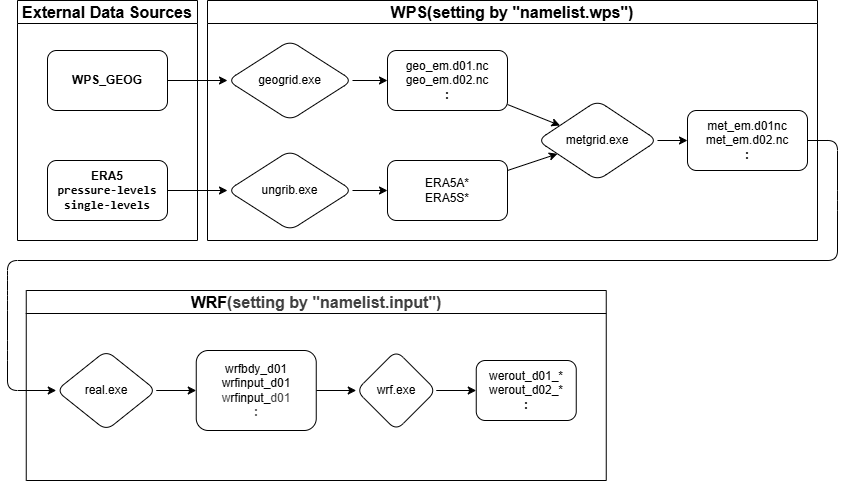
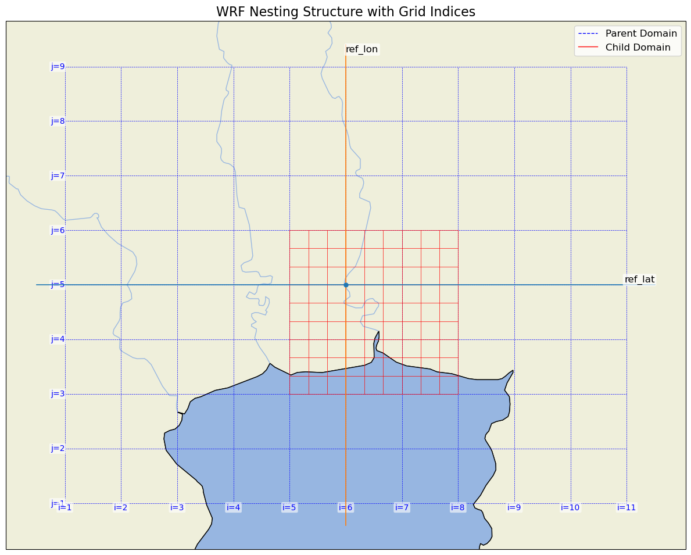
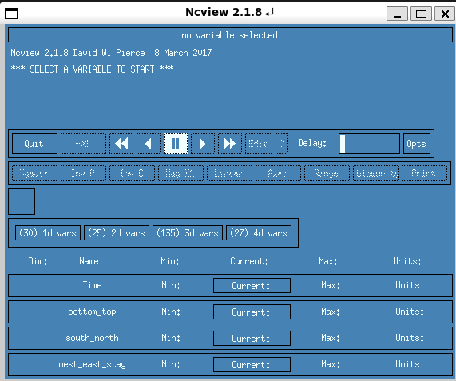
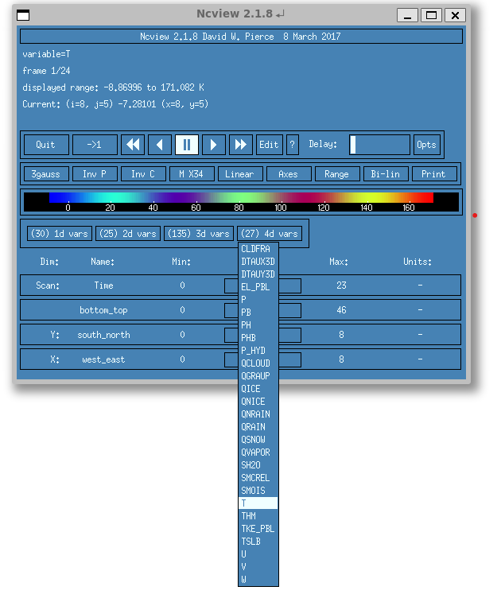
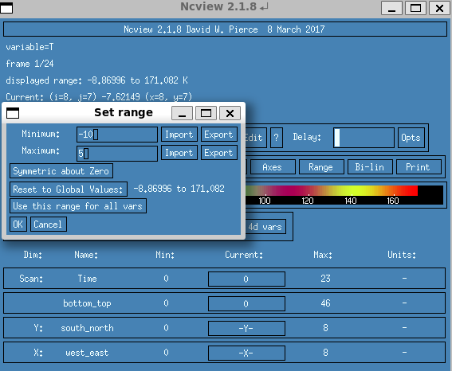
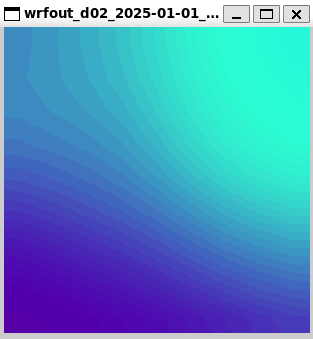
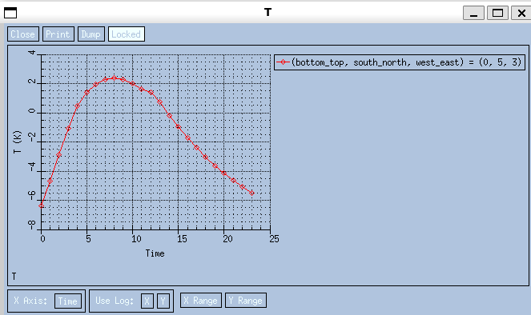

# WRF/WPS Workflow Document


## Preparation

### Library Path Setting
- Configure the Library path so that it is automatically reflected when logging in.

**File:** `~/.bashrc`
```bash
#example
DIR=<path-to-Library>
export NETCDF=$DIR/netcdf

export LD_LIBRARY_PATH=$NETCDF/lib:$DIR/grib2/lib:${LD_LIBRARY_PATH}
export PATH=$NETCDF/bin:$DIR/mpich/bin:$DIR/grib2/bin:${PATH}
export JASPERLIB=$DIR/grib2/lib
export JASPERINC=$DIR/grib2/include
```

[reference](https://forum.mmm.ucar.edu/threads/full-wrf-and-wps-installation-example-gnu.12385/)

### Checking the Installation Location of WRF / WPS

- Confirm that `WRF/main/real.exe`, `WRF/main/wrf.exe`, `WPS/geogrid.exe`, `WPS/ungrib.exe`, and `WPS/metgrid.exe` exist.

### 0. Downloading Geographic Data (GEOG)

- Obtain the WPS geographic data ([Geographical Input Data](https://www2.mmm.ucar.edu/wrf/users/download/get_sources_wps_geog.html)) and decide the extraction destination (example: `/data/`).
- A directory named `WPS_GEOG` will be created.

```bash
# Example: Create a directory
wget https://www2.mmm.ucar.edu/wrf/src/wps_files/geog_high_res_mandatory.tar.gz
tar xzvf geog_high_res_mandatory.tar.gz
```

```bash
WPS_GEOG/
├── albedo_modis
├── greenfrac_fpar_modis
├── lai_modis_10m
├── lai_modis_30s
├── maxsnowalb_modis
├── modis_landuse_20class_30s_with_lakes
├── orogwd_10m
├── orogwd_1deg
├── orogwd_20m
├── orogwd_2deg
├── orogwd_30m
├── soiltemp_1deg
├── soiltype_bot_30s
├── soiltype_top_30s
├── topo_gmted2010_30s
├── varsso
├── varsso_10m
├── varsso_2m
└── varsso_5m
```

#### 0.1 Optional Dataset
- **WUDAPT LCZ**

```bash
# Example: Create a directory
cd $WPS_GEOG
wget https://www2.mmm.ucar.edu/wrf/src/wps_files/cglc_modis_lcz_global.tar.gz
tar xzvf cglc_modis_lcz_global.tar.gz
```
### 1. Creating a Case Working Directory

Do not run a case directly in the WRF/WPS installation directories. Prepare a case-specific `RUN_DIR`, then copy the required WPS executables, WPS directories, WRF run files, and namelists into it.

```bash
export WPS=/path/to/WPS
export WRF=/path/to/WRF
export WPS_GEOG=/path/to/WPS_GEOG
export REANAL=/path/to/reanalysis
export SIMULATION=/path/to/simulation
export RUN_DIR="$SIMULATION/case01"

mkdir -p "$RUN_DIR"
cd "$RUN_DIR"

cp -r "$WPS/geogrid" "$WPS/ungrib" "$WPS/metgrid" .
cp "$WPS/geogrid.exe" "$WPS/ungrib.exe" "$WPS/metgrid.exe" "$WPS/link_grib.csh" .

find "$WRF/run" -maxdepth 1 \( -type f -o -type l \) ! -name "namelist.input" -exec cp -L {} . \;
cp "$WRF/main/real.exe" "$WRF/main/wrf.exe" .
```

Use a separate `RUN_DIR` for each experiment or sensitivity case.

### 2. Downloading Meteorological Data (ERA5)
- **Register for an ERA5 account**
From [this site](https://cds.climate.copernicus.eu/), click the button in the upper right ("Login-Register") to register and log in.

- **API Setup**
[CDSAPI setup](https://cds.climate.copernicus.eu/how-to-api)

- **`ungrib.exe` in WPS assumes GRIB files**. When obtaining ERA5 from CDS, choose **format=grib**.
> Note: It is common to combine single-level (surface) and pressure-level data in ERA5.

- Python (CDS API) example:

```python
# ERA5 download code using cdsapi
# pip install cdsapi
import cdsapi

client = cdsapi.Client()
dataset = 'reanalysis-era5-pressure-levels'
request = {
  'product_type': ['reanalysis'],
  'variable': [
      'geopotential',
      'relative_humidity',
      'temperature',
      'u_component_of_wind',
      'v_component_of_wind',
  ],
  'pressure_level': [
      '1', '2', '3', '5', '7', '10',
      '20', '30', '50', '70', '100', '125',
      '150', '175', '200', '225', '250', '300',
      '350', '400', '450', '500', '550', '600',
      '650', '700', '750', '775', '800', '825',
      '850', '875', '900', '925', '950', '975',
      '1000',
  ],
  'year': ['2025'],
  'month': ['01'],
  'day': ['01', '02', '03'],
  'time': [
      '00:00', '06:00', '12:00', '18:00',
  ],
  'data_format': 'grib',
  "download_format": "unarchived",
  "area": [20, 90, 0, 110]
}
target = 'download_pressure_levels.grib'

client.retrieve(dataset, request, target)

```

```python
client = cdsapi.Client()
dataset = 'reanalysis-era5-single-levels'
request = {
  'product_type': ['reanalysis'],
  'variable': [
    '10m_u_component_of_wind',
    '10m_v_component_of_wind',
    '2m_dewpoint_temperature',
    '2m_temperature',
    'land_sea_mask',
    'mean_sea_level_pressure',
    'sea_ice_cover',
    'sea_surface_temperature',
    'skin_temperature',
    'snow_depth',
    'soil_temperature_level_1',
    'soil_temperature_level_2',
    'soil_temperature_level_3',
    'soil_temperature_level_4',
    'surface_pressure',
    'volumetric_soil_water_layer_1',
    'volumetric_soil_water_layer_2',
    'volumetric_soil_water_layer_3',
    'volumetric_soil_water_layer_4',
  ],
  'year': ['2025'],
  'month': ['01'],
  'day': ['01', '02', '03'],
  'time': [
      '00:00', '06:00', '12:00', '18:00',
  ],
  'data_format': 'grib',
  "download_format": "unarchived",
  "area": [20, 90, 0, 110]
}
target = 'download_surface_levels.grib'

client.retrieve(dataset, request, target)
```

<div style="page-break-before:always"></div>

---

## Overall Flowchart

Running WRF/WPS is a workflow that combines geographic data, meteorological forcing data, namelists, and executables in the correct order. `WPS_GEOG` is shared across cases and usually only needs to be downloaded once. `RUN_DIR` should be prepared separately for each case.

| Step | Process |
|:---:|:---|
| 0 | Download and place `WPS_GEOG` |
| 1 | Confirm WRF/WPS locations and prepare a case-specific `RUN_DIR` |
| 2 | Prepare meteorological forcing data |
| 3 | Set simulation period, domains, and geographic data path in `namelist.wps` |
| 4 | Run `geogrid.exe` |
| 5 | Run `ungrib.exe` |
| 6 | Run `metgrid.exe` |
| 7 | Configure `namelist.input` |
| 8 | Run `real.exe` |
| 9 | Run `wrf.exe` |
| 10 | Check and visualize `wrfout` |


[(c) The WRF Preprocessing System (WPS)](https://www2.mmm.ucar.edu/wrf/users/wrf_users_guide/build/html/wps.html)

- **Flowchart of using ERA5 data.**



<div style="page-break-after: always;"></div>

---


## WPS
- In WPS, pre-downloaded geographical and meteorological data are integrated and adjusted for use in WRF simulations.
These configurations are specified in a file called `namelist.wps`, which is located in the WPS directory.

- [Details of WPS setting](https://www2.mmm.ucar.edu/wrf/users/wrf_users_guide/build/html/wps.html)


### 3. Time and Domain Settings
- **Edit namelist.wps**
```ini
&share
 wrf_core = 'ARW',
 max_dom = 2,
 start_date = "2025-01-01_00:00:00","2025-01-01_00:00:00",
 end_date = "2025-01-03_00:00:00","2025-01-03_00:00:00",
 interval_seconds = 10800
/
```

- `max_dom`: Number of domains.

- `interval_seconds` should match the time interval of the downloaded meteorological data.

<div style="page-break-after: always;"></div>

---

### 4. geogrid
- **Edit namelist.wps**
Set the domain for your area of interest and specify the path to "WPS_GEOG"..

```ini
&geogrid
 parent_id = 1,1,
 parent_grid_ratio = 1,3,
 i_parent_start = 1, 5,
 j_parent_start = 1, 3,
 e_we = 11, 10,
 e_sn = 9, 10,
 geog_data_res = "modis_landuse_20class_30s_with_lakes", "modis_landuse_20class_30s_with_lakes",
 dx = 18000,
 dy = 18000,
 map_proj = "mercator",
 ref_lat = 13.75,
 ref_lon = 100.5,
 truelat1 = 13.75,
 truelat2 = 13.75,
 stand_lon = 100.5,
 geog_data_path = "/<path-to-WPS_GEOG>/WPS_GEOG",
/
```
- `parent_id`: Specifies the parent domain for each domain. The first value is always `1` for the outermost domain (no parent), and subsequent values indicate which domain acts as the parent for nested domains.
  Example: `1, 1,` → Domain 1 has no parent, Domain 2's parent is Domain 1.

- `parent_grid_ratio`: Ratio of grid spacing between the parent and child domains.
  Example: `1, 3,` → Domain 1’s grid spacing ratio is 1 (reference), Domain 2 has a grid spacing three times finer than Domain 1.

- `i_parent_start`: The starting i-index (west-east direction) of the child domain inside its parent domain.
  Example: `1, 5,` → Domain 1 starts at index 1, Domain 2 starts at i-index 5 within Domain 1.

- `j_parent_start`: The starting j-index (south-north direction) of the child domain inside its parent domain.
  Example: `1, 3,` → Domain 1 starts at index 1, Domain 2 starts at j-index 3 within Domain 1.

- `e_we`: Number of grid points in the west-east direction for each domain.
  Example: `11, 10,` → Domain 1 has 11 points, Domain 2 has 10 points.

- `e_sn`: Number of grid points in the south-north direction for each domain.
  Example: `9, 10,` → Domain 1 has 9 points, Domain 2 has 10 points.

- `geog_data_res`: Specifies the geographical data resolution for each domain.
  Example: `"modis_landuse_20class_30s_with_lakes", "modis_landuse_20class_30s_with_lakes",` → Both domains use MODIS 20-class land use data at 30-second resolution with lakes.

- `dx, dy`: Grid spacing in the x-direction (west-east) or y-direction (south-north) for the outermost domain (in meters).
  Example: `18000` → 18 km resolution for Domain 1.


- `map_proj`: The map projection used for the domains.
  Example: `"mercator"` → Mercator projection.

- `ref_lat`, `ref_lon`: Reference latitude, longitude for the projection center.

- `truelat1`: First true latitude for projection (used in Lambert Conformal, Polar Stereographic, Mercator projections).
  Example: `13.75`.

- `truelat2`: Second true latitude (only used in Lambert Conformal projection). For Mercator, usually same as `truelat1`.
  Example: `13.75`.

- `stand_lon`: Standard longitude for projection (central meridian).
  Example: `100.5`.





- **Change the geogrid/GEOGRID.TBL.ARW file if you need**

- If you use lcz data.

```bash
cp geogrid/GEOGRID.TBL.ARW_LCZ geogrid/GEOGRID.TBL.ARW
```

We can use

```bash
./geogrid.exe
# Output: geo_em.d01.nc (and d02, d03... if nested domains exist)
```


> **[WRF Domain Wizard](https://wrfdomainwizard.net/) introduction**
> - A GUI tool to interactively set domain boundaries and resolution.
> - Adjust `geog_data_path` etc. to match the output `namelist.wps`.

<div style="page-break-after: always;"></div>


---


### 5. ungrib

- extracts meteorological fields from GRIB-formatted files
- ERA5 data is categorized into single-level (surface) and pressure-level datasets, so ungrib must be applied to each dataset individually.
1. **Edit namelist.wps**

    ```ini
    # pressure levels
    &ungrib
    out_format = 'WPS',
    prefix = "ERA5A", # pressure -> "ERA5A"
    /
    ```

2. **Select Vtable**

   ```bash
   cd $WPS_DIR
   # Vtable for ERA5 (Vtable.ECMWF)
   ln -sf ungrib/Variable_Tables/Vtable.ECMWF Vtable
   ```

3. **Link GRIB files**
   ```bash
   ./link_grib.csh /path/to/era5/*<pressure-file>.grib
   ```

4. **Run ungrib**
   ```bash
   ./ungrib.exe
   # Output: ERA5A:2025-01-01_00, ERA5A:2025-01-01_03, ...
   ```
- **Do the same for surface_levels files.**

    ```ini
    # surface levels
    &ungrib
    out_format = 'WPS',
    prefix = "ERA5S", # surface -> "ERA5S"
    /
    ```

    ```bash
   ./link_grib.csh /path/to/era5/*<surface-file>.grib
   ```

    ```bash
   ./ungrib.exe
   # Output: ERA5S:2025-01-01_00, ERA5S:2025-01-01_03, ...
   ```


---

### 6. metgrid
- horizontally interpolates the meteorological fields extracted by ungrib to the model grids defined by geogrid
  - Metgrid is also capable of combining two or more complementary data sets
  - If surface fields are given in one data source(`ERA5S`) and upper-air data(`ERA5A`) are given in another,
  the values assigned to the `fg_name` variable may look something like:

```ini
&metgrid
 fg_name = "ERA5A", "ERA5S",
/
```

```bash
cd $WPS_DIR
./metgrid.exe
# Output: met_em.d01.2025-01-01_00:00:00.nc etc.
```
- Check `metgrid.log` for interpolation warnings (missing values etc.).
- For multiple domains, d01, d01… will also be generated.

<div style="page-break-after: always;"></div>

---

## WRF

### 7. Settings
For details: [README.namelist](https://github.com/wrf-model/WRF/blob/master/run/README.namelist)

#### 7.1 Time settings
- Set it to match the period specified in **namelist.wps**.
  For `run_day` and `run_hour`, write the number of days corresponding to that period.
  > if the total run length is 36 hrs, you may set run_days = 1, and run_hours = 12, or run_days = 0, and run_hours = 36.

  `history_interval`: history output file interval in minutes
  `frames_per_outfile` : number of output times per history output file

```ini
&time_control
run_days=2
run_hours=0
 run_minutes                         = 0,
 run_seconds                         = 0,
start_year=2025, 2025,
start_month=1, 1,
start_day=1, 1,
start_hour=0, 0,
end_year=2025, 2025,
end_month=1, 1,
end_day=3, 3,
end_hour=0, 0,
 interval_seconds                    = 10800
input_from_file=.true., .true.
history_interval=60,60,
frames_per_outfile=24,24,
...
/
```

#### 7.2 Domain setting
- Set it to match the domain specified in **namelist.wps**.
  `time_step`: recommend 6*dx (in km)
  `e_vert`: end index in z (vertical) direction (staggered dimension)

  `num_metgrid_levels`: number of vertical levels of 3d meteorological fields (check your input data)
  `num_metgrid_soil_levels`: number of vertical soil levels or layers input
  `feedback`: define a two-way nested(1) or one-way nested(0). [Details](https://www2.mmm.ucar.edu/wrf/users/wrf_users_guide/build/html/running_wrf.html#wrf-nesting)


```ini
 &domains
time_step=108
...
max_dom=2,
e_we = 11, 10,
e_sn = 9, 10,
e_vert=48, 48 !end index in z (vertical) direction (staggered dimension)
...
num_metgrid_levels = 38,
num_metgrid_soil_levels = 4,
dx=18000.0, 6000.0
dy=18000.0, 6000.0
grid_id=1,2
parent_id=1,1
i_parent_start = 1, 5,
j_parent_start = 1, 3,
parent_grid_ratio=1,3,
parent_time_step_ratio=1, 3
feedback=0
smooth_option                       = 0
 /
...
```

#### 7.3 Physics scheme options
- In WRF, many **physical parameterization schemes** are available to represent processes that cannot be explicitly resolved by the governing equations (e.g., radiation, cloud, land surface processes, and other subgrid-scale phenomena).

  More details in [WRF Physics](https://www2.mmm.ucar.edu/wrf/users/wrf_users_guide/build/html/physics.html).

```ini
 &physics
 physics_suite                       = 'CONUS'
 mp_physics                          = -1,    -1,
 cu_physics                          = -1,    -1,
 ra_lw_physics                       = -1,    -1,
 ra_sw_physics                       = -1,    -1,
 bl_pbl_physics                      = -1,    -1,
 sf_sfclay_physics                   = -1,    -1,
 sf_surface_physics                  = -1,    -1,
 radt                                = 15,    15,
 bldt                                = 0,     0,
 cudt                                = 0,     0,
 icloud                              = 1,
 num_land_cat                        = 21,
 sf_urban_physics                    = 0,     0,
 fractional_seaice                   = 1,
 /

  &fdda
 /
```

#### 7.4 Dynamics options
- WRF (WRF-ARW) model uses a dynamical solver to perform time and space integration of the equations of motion.

  More details in [WRF Dynamics](https://www2.mmm.ucar.edu/wrf/users/wrf_users_guide/build/html/dynamics.html).

```ini
 &dynamics
 hybrid_opt                          = 2,
 w_damping                           = 0,
 diff_opt                            = 2,      2,
 km_opt                              = 4,      4,
 diff_6th_opt                        = 0,      0,
 diff_6th_factor                     = 0.12,   0.12,
 base_temp                           = 290.
 damp_opt                            = 3,
 zdamp                               = 5000.,  5000.,
 dampcoef                            = 0.2,    0.2,
 khdif                               = 0,      0,
 kvdif                               = 0,      0,
 non_hydrostatic                     = .true., .true.,
 moist_adv_opt                       = 1,      1,
 scalar_adv_opt                      = 1,      1,
 gwd_opt                             = 1,      0,
 /
```

```ini
 &bdy_control
 spec_bdy_width                      = 5,
 specified                           = .true.
 /

 &grib2
 /

 &namelist_quilt
 nio_tasks_per_group = 0,
 nio_groups = 1,
 /

```
*(Omitted for brevity — keep original code block)*

---

### 8. real.exe
```bash
cd $WRF_DIR/run

# Link or copy met_em from WPS output
ln -sf $WPS_DIR/met_em.d0* .

# Place namelist.input and run
./real.exe
# If successful, wrfbdy_d01 and wrfinput_d01 (and d02... if nested) will be generated
```
- On failure, check `rsl.error.0000`.

### 9. wrf.exe
- **Serial run**
  ```bash
  ./wrf.exe
  ```
- **MPI run**
  ```bash
  mpirun -np 8 ./wrf.exe
  # or
  mpiexec -n 8 ./wrf.exe
  ```
- Logs are output to `rsl.out.* / rsl.error.*`. Check progress by the generation of `wrfout_d01_...`.

<div style="page-break-after: always;"></div>

---

## Visualization

### 10. ncview
- Install
```bash
 sudo apt install ncview
 ```

- Usage
```bash
ncview <netcdf-file>
```

- Select a variable.
> T is potential temperature (K). but the value is `T = Potential temperature - 300`




- Set the range by assigning `Range` if you need.




- Change the time by triangle play icon.


- By clicking any point on the output display, you can view the time variation at that location.




## Automated Execution with WRF_tools

For automated execution, use `ERA5DataDownloader` and `WRFProcessor` from `WRF_tools`.
See [WRF_tools User Guide](./wrf_tools_usage.md) for the Python workflow.

- `ERA5DataDownloader`: downloads ERA5 GRIB files.
- `WRFProcessor`: prepares `RUN_DIR` and runs `geogrid.exe`, `ungrib.exe`, `metgrid.exe`, `real.exe`, and `wrf.exe`.

Set `ERA5DataDownloader(..., time_interval_hours=3)` for 3-hourly ERA5, or `time_interval_hours=1` for hourly ERA5. This should match `interval_seconds` in `namelist.wps`.


<div style="page-break-after: always;"></div>


## Appendix: Common Pitfalls (Short Version)
- **`interval_seconds` mismatch**: If ERA5 is 3h but set to 1h, values may be missing. Match to the acquisition interval.
- **Insufficient required variables**: If required surface + upper-level variables are missing, `metgrid/real` will stop. Review the variable list.
- **Domain/resolution mismatch**: Poor balance between `dx, dy` and `time_step` can cause instability. As a rule of thumb, `time_step ≈ dx(km) × 6`.


## Run at other directory

- If you want to run WRF in another location (directory), you only need to copy the following directories and files from `WPS` and `WRF/run`.
